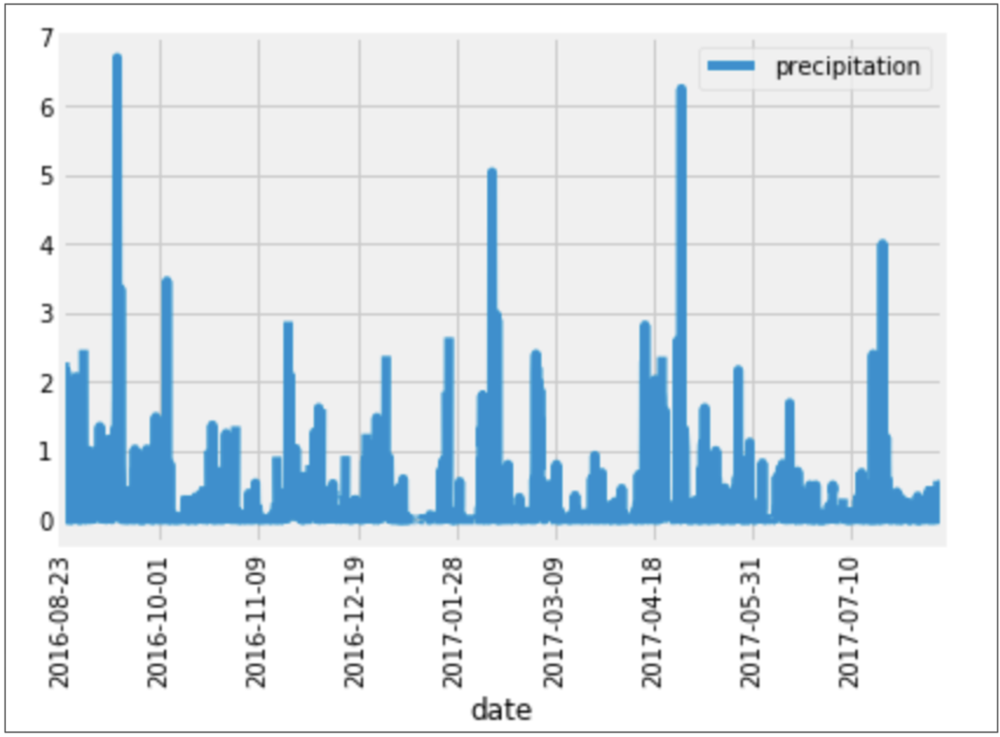

# surfs_up
SQLite Python Flask

## Overview of the Project
This project is to provide weather data to support a business plan to open a Surf and Ice 
Cream shop in Hawaii. Using Python, Pandas and SQLAlchemy to present weather statisics
for certain months in the Hawaiian Islands to determine which island would be the best
location and to determine an ice cream shop sustainability year-round.

## Results

We designed a query to retrieve the last 12 months of precipitation data and plotted the results.

The trend we can observe based on this plot is that some months have higher amounts of precipitation
than others. Those months being September, February and May.

## Summary

Here are visuals of the movies table and ratings table of the new database;

